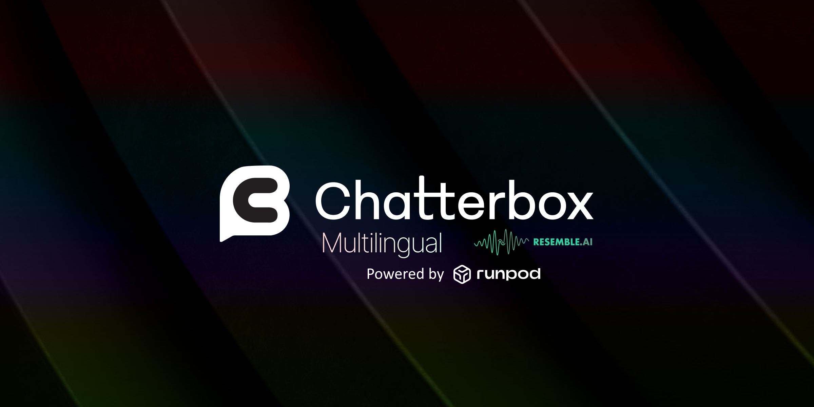

# Chatterbox Multilingual TTS – RunPod Serverless Edition

> **Fork Notice**  
> This is an **unofficial, packaging-focused fork** of **[Resemble AI / Chatterbox](https://github.com/resemble-ai/chatterbox)**. It keeps the original model behavior and licensing while tailoring the repository for **RunPod Serverless GPU inference**.
>
> For full research, extended examples, training or broader utilities: use the upstream repository. PRs welcome if they remain narrowly focused on serverless operability.

[](https://resemble-ai.github.io/chatterbox_demopage/)
[](https://huggingface.co/spaces/ResembleAI/Chatterbox)
[](https://podonos.com/resembleai/chatterbox)
[](https://discord.gg/rJq9cRJBJ6)

_Original model created by_ <a href="https://resemble.ai" target="_blank"></a>

**Chatterbox Multilingual** is an open source TTS model from [Resemble AI](https://resemble.ai) supporting **23 languages** (MIT licensed). It is frequently preferred in blind comparisons versus closed systems and includes **emotion exaggeration control** plus **zero-shot multilingual voice cloning**.

This fork only changes packaging for cloud/serverless execution - model weights & inference logic remain identical. For upstream documentation, demos, and broader tooling:
- Upstream: https://github.com/resemble-ai/chatterbox
- HF (English): https://huggingface.co/spaces/ResembleAI/Chatterbox
- HF (Multilingual): https://huggingface.co/spaces/ResembleAI/Chatterbox-Multilingual-TTS

Primary target audience of this fork: builders who want on-demand GPU inference via **RunPod Serverless** without managing local environments.

---

## 1. Overview

Chatterbox Multilingual provides:
- 23 language support & robust accent retention
- 0.5B Llama backbone with alignment-informed inference
- Zero-shot style & multilingual voice transfer from short WAV prompts
- Expressiveness control (`exaggeration`) and style/clarity balancing (`cfg_weight`)
- Built-in watermarking (PerTh) for responsible AI

### Why this fork
| Need | What this fork adds |
|------|---------------------|
| Rapid deployment | Ready Dockerfile & handler for RunPod Serverless |
| Stateless HTTPS usage | Simple JSON in → base64 WAV out |
| Autoscaling | Leverage RunPod cold start then warm reuse |
| Minimal surface area | Focused docs; removed broader training/dev material |

---

## 2. Supported Languages
Arabic (ar) • Danish (da) • German (de) • Greek (el) • English (en) • Spanish (es) • Finnish (fi) • French (fr) • Hebrew (he) • Hindi (hi) • Italian (it) • Japanese (ja) • Korean (ko) • Malay (ms) • Dutch (nl) • Norwegian (no) • Polish (pl) • Portuguese (pt) • Russian (ru) • Swedish (sv) • Swahili (sw) • Turkish (tr) • Chinese (zh)

---

## 3. Quick Start on RunPod (Serverless)
Deploy the container, send HTTPS jobs, receive base64 WAV.

### 3.1 Steps
1. Create RunPod account + API key (Dashboard → API Keys).  
2. Build & push image (or enable GitHub auto-build).  
3. In RunPod: Serverless → Create Endpoint → Custom Image.  
4. Select suitable GPU (>=12GB VRAM recommended).  
5. Wait for READY; note `ENDPOINT_ID`.

### 3.2 Input Schema
`POST https://api.runpod.ai/v2/<ENDPOINT_ID>/run`

```json
{
  "input": {
    "text": "Hello world from Chatterbox on RunPod!",
    "language": "en",
    "audio_prompt_path": null,
    "repetition_penalty": 1.2,
    "min_p": 0.05,
    "top_p": 1.0,
    "exaggeration": 0.5,
    "cfg_weight": 0.5,
    "temperature": 0.8,
    "return_format": "base64"
  }
}
```
Required: `text`. Others have defaults. See **Parameter Guide** section for full details.

### 3.3 Response
```json
{
  "id": "JOB_ID",
  "status": "COMPLETED",
  "output": {
    "audio_base64": "UklGRiQAAABXQVZFZm10IBAAAAABAAEA...",
    "sample_rate": 24000,
    "format": "wav",
    "language_used": "en",
    "model_used": "english"
  }
}
```

### 3.4 Usage Examples
#### Curl (Linux / macOS)
```bash
# English TTS
curl -X POST https://api.runpod.ai/v2/$ENDPOINT_ID/run \
  -H "Authorization: Bearer $RUNPOD_API_KEY" \
  -H "Content-Type: application/json" \
  -d '{"input": {"text": "Testing Chatterbox serverless on RunPod.", "language": "en"}}' \
  | jq -r '.output.audio_base64' > b64.txt
base64 -d b64.txt > output.wav

# Multilingual (Spanish)
curl -X POST https://api.runpod.ai/v2/$ENDPOINT_ID/run \
  -H "Authorization: Bearer $RUNPOD_API_KEY" \
  -H "Content-Type: application/json" \
  -d '{"input": {"text": "Hola, probando Chatterbox multilingüe.", "language": "es"}}' \
  | jq -r '.output.audio_base64' > b64.txt
base64 -d b64.txt > output_es.wav
```

#### PowerShell (Windows)
```powershell
curl -Method POST "https://api.runpod.ai/v2/$env:ENDPOINT_ID/run" `
  -H "Authorization: Bearer $env:RUNPOD_API_KEY" `
  -H "Content-Type: application/json" `
  -Body '{"input":{"text":"Testing Chatterbox serverless on RunPod.", "language":"en"}}' |
  ConvertFrom-Json | Select -ExpandProperty output | Select -ExpandProperty audio_base64 |
  ForEach-Object { [IO.File]::WriteAllBytes("output.wav", [Convert]::FromBase64String($_)) }
```

#### Python
```python
import os, base64, requests

ENDPOINT_ID = os.environ["ENDPOINT_ID"]
API_KEY = os.environ["RUNPOD_API_KEY"]
url = f"https://api.runpod.ai/v2/{ENDPOINT_ID}/run"

# English TTS with expressive parameters
payload = {
    "input": {
        "text": "Hello from a Python client!", 
        "language": "en",
        "exaggeration": 0.6, 
        "cfg_weight": 0.4,
        "temperature": 0.9
    }
}
resp = requests.post(url, json=payload, headers={"Authorization": f"Bearer {API_KEY}"})
resp.raise_for_status()
data = resp.json()["output"]
audio_bytes = base64.b64decode(data["audio_base64"])
with open("speech_en.wav", "wb") as f:
    f.write(audio_bytes)
print(f"Wrote speech_en.wav at {data['sample_rate']} Hz using {data['model_used']} model")

# Multilingual French TTS
payload_fr = {
    "input": {
        "text": "Bonjour depuis un client Python!", 
        "language": "fr",
        "exaggeration": 0.5, 
        "cfg_weight": 0.5
    }
}
resp_fr = requests.post(url, json=payload_fr, headers={"Authorization": f"Bearer {API_KEY}"})
resp_fr.raise_for_status()
data_fr = resp_fr.json()["output"]
audio_bytes_fr = base64.b64decode(data_fr["audio_base64"])
with open("speech_fr.wav", "wb") as f:
    f.write(audio_bytes_fr)
print(f"Wrote speech_fr.wav at {data_fr['sample_rate']} Hz using {data_fr['model_used']} model")
```

#### Node (fetch)
```js
import fs from 'node:fs';

const ENDPOINT_ID = process.env.ENDPOINT_ID;
const API_KEY = process.env.RUNPOD_API_KEY;
const url = `https://api.runpod.ai/v2/${ENDPOINT_ID}/run`;

// English TTS
const bodyEn = { input: { text: "Hello from Node fetch.", language: "en", temperature: 0.85, exaggeration: 0.55 } };
const resEn = await fetch(url, { method: 'POST', headers: { 'Authorization': `Bearer ${API_KEY}`, 'Content-Type': 'application/json' }, body: JSON.stringify(bodyEn) });
const jsonEn = await resEn.json();
fs.writeFileSync('speech_en.wav', Buffer.from(jsonEn.output.audio_base64, 'base64'));
console.log(`Saved speech_en.wav using ${jsonEn.output.model_used} model`);

// Multilingual German TTS
const bodyDe = { input: { text: "Hallo von Node fetch.", language: "de", temperature: 0.8, exaggeration: 0.5 } };
const resDe = await fetch(url, { method: 'POST', headers: { 'Authorization': `Bearer ${API_KEY}`, 'Content-Type': 'application/json' }, body: JSON.stringify(bodyDe) });
const jsonDe = await resDe.json();
fs.writeFileSync('speech_de.wav', Buffer.from(jsonDe.output.audio_base64, 'base64'));
console.log(`Saved speech_de.wav using ${jsonDe.output.model_used} model`);
```

---

## 4. Parameter Guide

### 4.1 Complete Parameter Reference

| Parameter | Purpose | Default | Range/Options | Notes |
|-----------|---------|---------|---------------|--------|
| **`text`** | Input text to synthesize (required) | - | Any non-empty string | The only required parameter |
| **`language`** | Target language for synthesis | `"en"` | See **Supported Languages** | Auto-selects appropriate model |
| **`audio_prompt_path`** | Reference voice WAV for zero-shot cloning | `null` | File path or null | Enables voice cloning when provided |
| **`exaggeration`** | Emotional intensity control | `0.5` | `0.25`–`2.0` | Higher = more expressive/dramatic |
| **`cfg_weight`** | Style fidelity vs clarity/pacing | `0.5` | `0.0`–`1.0` | Lower = better pacing, less style fidelity |
| **`temperature`** | Sampling randomness | `0.8` | `0.05`–`5.0` | Higher = more diverse/creative output |
| **`repetition_penalty`** | Reduce repetitive patterns | `1.2` (EN), `2.0` (ML) | `1.0`–`2.0` | Higher = less repetition |
| **`min_p`** | Minimum probability threshold | `0.05` | `0.0`–`1.0` | Sampling parameter for diversity |
| **`top_p`** | Nucleus sampling parameter | `1.0` | `0.0`–`1.0` | Sampling parameter for diversity |
| **`return_format`** | Output encoding format | `"base64"` | `"base64"` | Currently only base64 supported |

### 4.2 Supported Languages (23)
```
ar (Arabic)    • da (Danish)     • de (German)    • el (Greek)
en (English)   • es (Spanish)    • fi (Finnish)   • fr (French) 
he (Hebrew)    • hi (Hindi)      • it (Italian)   • ja (Japanese)
ko (Korean)    • ms (Malay)      • nl (Dutch)     • no (Norwegian)
pl (Polish)    • pt (Portuguese) • ru (Russian)   • sv (Swedish)
sw (Swahili)   • tr (Turkish)    • zh (Chinese)
```

### 4.3 Model Selection Logic
- **English (`en`)**: Uses optimized English-only model (`ChatterboxTTS`)
- **All other languages**: Uses multilingual model (`ChatterboxMultilingualTTS`) 
- **Default repetition_penalty**: `1.2` for English, `2.0` for multilingual

### 4.4 Tuning Tips & Best Practices

#### Expressive & Dramatic Speech
```json
{
  "exaggeration": 0.7,
  "cfg_weight": 0.3,
  "temperature": 0.8
}
```

#### Clear & Neutral Professional Speech  
```json
{
  "exaggeration": 0.4,
  "cfg_weight": 0.6,
  "temperature": 0.7,
  "repetition_penalty": 1.1
}
```

#### Cross-language Accent Reduction
```json
{
  "cfg_weight": 0.0,
  "exaggeration": 0.5
}
```

#### Fast Reference Audio Pacing Fix
```json
{
  "cfg_weight": 0.3,
  "temperature": 0.7
}
```

### 4.5 Advanced Usage
- **Voice Cloning**: Provide `audio_prompt_path` with reference WAV file (ideally 3-10 seconds)
- **Language Matching**: Reference audio language should match target `language` for best results
- **Parameter Interaction**: `min_p`, `top_p`, and `temperature` work together - adjust carefully
- **Model Performance**: Multilingual model loads automatically when non-English language is specified

---

## 5. Local (Optional) Testing
You can still run locally for experimentation:
```bash
pip install chatterbox-tts runpod
python handler.py
```

---

## 6. Roadmap (Fork Scope)
- ✅ **Multilingual support with automatic model selection** (completed)
- Optional object storage return (signed URL instead of base64)
- Streaming or chunked audio output
- Batch processing support for multiple texts
- Voice prompt upload via URL/base64

---

## 7. Troubleshooting
| Issue | Likely Cause | Mitigation |
|-------|--------------|------------|
| High first latency | Model cold start | Keep min instances > 0 or accept warmup |
| 429 / timeouts | Concurrency exceeded | Increase autoscale or batch requests |
| Empty / noisy audio | Extreme params / empty text | Reset to defaults, verify text |
| Voice cloning unchanged | Missing `audio_prompt_path` file | Verify path baked into image |

---

## 8. Security Notes
Treat RunPod API keys as secrets. For production, proxy calls through your backend and enforce auth + rate limits.

---

## 9. Watermarking (PerTh)
All audio includes [Resemble AI's Perth Watermarker](https://github.com/resemble-ai/perth) (imperceptible, robust). Extraction example:
```python
import perth, librosa
audio, sr = librosa.load("YOUR_FILE.wav", sr=None)
wm = perth.PerthImplicitWatermarker().get_watermark(audio, sample_rate=sr)
print("Extracted watermark:", wm)  # 0.0 none / 1.0 present
```

---

## 10. Attribution & Acknowledgements
Core model credit: [Resemble AI Chatterbox](https://github.com/resemble-ai/chatterbox).

Other inspirations / components:
- [Cosyvoice](https://github.com/FunAudioLLM/CosyVoice)
- [Real-Time-Voice-Cloning](https://github.com/CorentinJ/Real-Time-Voice-Cloning)
- [HiFT-GAN](https://github.com/yl4579/HiFTNet)
- [Llama 3](https://github.com/meta-llama/llama3)
- [S3Tokenizer](https://github.com/xingchensong/S3Tokenizer)

---

## 11. Citation
If you find this model useful, please cite:
```
@misc{chatterboxtts2025,
  author       = {{Resemble AI}},
  title        = {{Chatterbox-TTS}},
  year         = {2025},
  howpublished = {\url{https://github.com/resemble-ai/chatterbox}},
  note         = {GitHub repository}
}
```

---

## 12. Disclaimer
Do not use this model for harmful purposes. Prompts were sourced from publicly available internet data.

---

## 13. Community
Join the official Chatterbox community on **[Discord](https://discord.gg/rJq9cRJBJ6)**.

